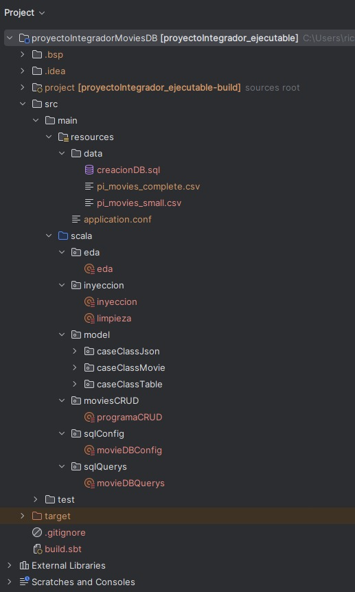
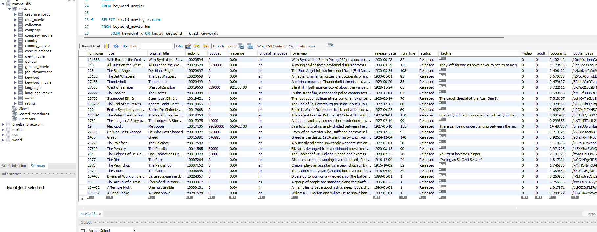

# PROYECTO INTEGRADOR - PRACTICUM 1.1

#### NOTA: EL PROYECTO SE ENCUENTRA EN LA CARPETA "proyectoIntegradorMoviesDB"

### Integrantes
- #### Ricardo Fabian Espinosa Largo
- #### Carlos David Sanchez Carrion
- #### Fernando Alonso Ocampo Gonzaga
- #### Andres Israel Cuenca Cañar

# Objetivos

Desarrollar una **base de datos funcional y robusta** a partir de un dataset en formato `.csv` que contiene información sobre películas. Para lograr este propósito, se llevará a cabo un proceso detallado que incluye la **limpieza, transformación, estructuración y organización** de los datos, garantizando su **integridad, coherencia y accesibilidad**.

### Objetivos específicos:

1. **Limpieza de los datos**
    - Identificar y eliminar datos duplicados para evitar redundancia.
    - Manejar valores nulos o faltantes mediante técnicas de imputación o eliminación selectiva.
    - Estandarizar formatos de fechas, nombres y otras variables clave.
    - Corregir errores tipográficos o inconsistencias en los datos.

2. **Transformación y normalización**
    - Aplicar técnicas de normalización para mejorar la estructura de la base de datos.
    - Dividir los datos en múltiples tablas relacionadas para mejorar la eficiencia de almacenamiento y consulta.
    - Definir claves primarias y foráneas para asegurar la integridad referencial.

3. **Carga de datos en la base de datos**
    - Implementar un esquema de base de datos relacional utilizando un gestor de bases de datos adecuado (por ejemplo, PostgreSQL, MySQL o SQLite).
    - Insertar los datos limpios y transformados en la base de datos.
    - Verificar la correcta indexación y optimización de las tablas.
4. **Consultas y análisis de datos**
    - Desarrollar consultas SQL para extraer información relevante y realizar análisis exploratorios.
    - Crear vistas y procedimientos almacenados para mejorar la accesibilidad a la información.
    - Implementar consultas eficientes para responder preguntas clave sobre las películas en el dataset.
5. **Documentación**
    - Documentar el esquema de la base de datos, incluyendo relaciones, restricciones y normalización aplicada.
    - Proveer guías de uso y consulta para facilitar la manipulación de la base de datos por parte de otros usuarios.

## Estructura guía del proyecto

Una vez dentro del proyecto, en el paquete "src/main" se encuentran dos carpetas:

- **resources:** En este paquete encontramos un subpaquete "/data" que es donde se encuentran los archivos necesarios para el funcionamiento del programa, los archivos .csv y el .sql para crear la DB,
tambien se encuentra el archivo .conf que es donde se almacena la configuracion de la base de datos.


- **scala:** Aqui a su vez encontramos varios paquetes, en **"/eda"** se encuentra el programa para realizar la estadistica descriptiva, en **"/inyeccion/inyeccion.scala"** se encuentra el programa para hacer la limpieza y poblado de la base de datos leyendo en csv del dataset,
en **"/model"** se encuentran las case class para el modelo de todos los programas, en **"/moviesCRUD"** se encuentra el programa para hacer consultas desde la base de datos ya creada,
en **"/sqlConfig"** se encuentra el transactor que nos permite conectarnos a la DB y hacer operaciones y por ultimo en **"/sqlQuerys"** se encuentran las sentencias sql para darle las instrucciones a la DB.




**NOTA:** Antes de hacer la ejecucion de cualquiera de los programas antes mencionados asegurarse de cargar en la carpeta **"/resources"** el archivo **"pi_movies_complete.csv"** y crear el archivo **"application.conf"** con la informacion personal de la base de datos,
ademas no olvidar leer la documentacion que esta al inicio del script **"/inyeccion.scala"**

# Generalidades del Dataset

El conjunto de datos utilizado en este proyecto proviene de la plataforma Kaggle y fue proporcionado por **Rounak Banik**, un profesional en ciencia de datos. Fue creado con el propósito de desarrollar un **sistema de recomendación de películas** y contiene información detallada sobre películas lanzadas hasta julio de 2017.

Los datos han sido recopilados de **dos fuentes principales**:

1. **TMDB (The Movie Database)**
    - Proporciona información sobre películas, incluidos reparto, equipo, palabras clave de la trama, presupuesto, ingresos, carteles, fechas de lanzamiento, idiomas, compañías de producción, países de origen, recuentos de votos y promedios de calificación.

2. **MovieLens**
    - Contiene **5 millones de calificaciones** de aproximadamente **270,000 usuarios** para todas las peliculas incluidas en el dataset.
    - Las calificaciones van de **1 a 5** y se obtienen del sitio oficial de **GroupLens**.

El dataset se compone de 2 archivos `.csv` que incluyen:

- **pi_movies_complete.csv** → Archivo para la entrega final.
- **pi_movies_small.csv** → Archivo para pruebas.

# Estructura de los Datos

A continuación, se presenta una tabla con los principales atributos del dataset, su tipo de dato y una breve descripción:

| **Atributo**             | **Tipo de Dato** | **Descripción** |
|--------------------------|-----------------|----------------|
| `adult`                 | Booleano        | Indica si la película es para adultos (`True`) o no (`False`). |
| `budget`                | Entero          | Presupuesto de la película en dólares. |
| `homepage`              | String          | URL de la página web oficial de la película. |
| `id`                    | Entero          | Identificador único de la película. |
| `imdb_id`               | String          | Identificador único en IMDb. |
| `original_language`     | String          | Idioma original en que fue filmada (`en`, `es`, etc.). |
| `original_title`        | String          | Título original de la película. |
| `overview`              | String          | Resumen breve de la trama de la película. |
| `popularity`            | Float           | Puntuación de popularidad asignada por TMDB. |
| `poster_path`           | String          | Ruta de la imagen del póster de la película. |
| `release_date`          | Fecha (YYYY-MM-DD) | Fecha de estreno de la película. |
| `revenue`              | Entero          | Ingresos totales generados por la película en dólares. |
| `runtime`               | Entero          | Duración de la película en minutos. |
| `status`               | String          | Estado de la película (`Released`, `Announced`, etc.). |
| `tagline`               | String          | Frase promocional de la película. |
| `title`                 | String          | Título oficial de la película. |
| `video`                 | Booleano        | Indica si hay un video asociado (`True` o `False`). |
| `vote_average`         | Float           | Calificación promedio basada en los votos de los usuarios de TMDB. |
| `vote_count`           | Entero          | Número total de votos recibidos. |

### Atributos en Formato JSON

Algunos atributos están almacenados como objetos **JSON**, lo que significa que contienen información anidada. Estos incluyen:

| **Atributo**              | **Descripción** |
|---------------------------|----------------|
| `belongs_to_collection`   | Información sobre la franquicia o saga a la que pertenece la película. |
| `genres`                 | Lista de géneros asociados a la película. |
| `production_companies`    | Lista de compañías que participaron en la producción. |
| `production_countries`    | Lista de países donde se filmó la película. |
| `spoken_languages`        | Lista de idiomas hablados en la película. |
| `keywords`               | Palabras clave asociadas a la trama de la película. |
| `cast`                   | Información sobre los actores y sus roles. |
| `crew`                   | Información sobre el equipo de producción y sus funciones. |
| `ratings`                | Calificaciones dadas por los usuarios. |

### Descripcion de atributos de datos JSON

### 1. `belongs_to_collection` (JSON)
Este atributo representa la colección o saga a la que pertenece una película.

| **Campo**        | **Tipo de Dato** | **Descripción** |
|------------------|----------------|----------------|
| `id`            | Entero          | Identificador único de la colección. |
| `name`          | String          | Nombre de la colección. |
| `poster_path`   | String          | Ruta de la imagen del póster de la colección. |
| `backdrop_path` | String          | Ruta de la imagen de fondo asociada a la colección. |

---

### 2. `genres` (Arreglo de JSON)
Lista de géneros cinematográficos asignados a la película.

| **Campo** | **Tipo de Dato** | **Descripción** |
|-----------|----------------|----------------|
| `id`      | Entero         | Identificador único del género. |
| `name`    | String         | Nombre del género (Ejemplo: `Comedy`, `Drama`). |

---

### 3. `production_companies` (Arreglo de JSON)
Contiene información sobre las compañías de producción que participaron en la película.

| **Campo** | **Tipo de Dato** | **Descripción** |
|-----------|----------------|----------------|
| `id`      | Entero         | Identificador único de la compañía. |
| `name`    | String         | Nombre de la compañía de producción. |

---

### 4. `production_countries` (Arreglo de JSON)
Lista de países donde se produjo o filmó la película.

| **Campo**    | **Tipo de Dato** | **Descripción** |
|-------------|----------------|----------------|
| `iso_3166_1` | String         | Código ISO del país (`US`, `GB`, etc.). |
| `name`      | String         | Nombre del país (`United States of America`, `United Kingdom`). |

---

### 5. `spoken_languages` (Arreglo de JSON)
Lista de idiomas hablados en la película.

| **Campo**    | **Tipo de Dato** | **Descripción** |
|-------------|----------------|----------------|
| `iso_639_1` | String         | Código ISO del idioma (`en`, `es`, etc.). |
| `name`      | String         | Nombre del idioma (`English`, `Italiano`). |

---

### 6. `keywords` (Arreglo de JSON)
Palabras clave que describen la temática de la película.

| **Campo** | **Tipo de Dato** | **Descripción** |
|-----------|----------------|----------------|
| `id`      | Entero         | Identificador único de la palabra clave. |
| `name`    | String         | Nombre de la palabra clave (`biography`, `historical figure`). |

---

### 7. `cast` (Arreglo de JSON)
Contiene la información del elenco de la película.

| **Campo**      | **Tipo de Dato** | **Descripción** |
|---------------|----------------|----------------|
| `cast_id`     | Entero         | Identificador único del actor en el contexto de la película. |
| `character`   | String         | Nombre del personaje interpretado. |
| `credit_id`   | String         | Identificador único del crédito en TMDB. |
| `gender`      | Entero         | Género del actor (`0`: No especificado, `1`: Femenino, `2`: Masculino). |
| `id`          | Entero         | Identificador único del actor en TMDB. |
| `name`        | String         | Nombre del actor. |
| `order`       | Entero         | Posición en la lista de reparto (los protagonistas suelen tener valores más bajos). |
| `profile_path`| String         | Ruta de la imagen del perfil del actor. |

---

### 8. `crew` (Arreglo de JSON)
Contiene información sobre los miembros del equipo de producción.

| **Campo**      | **Tipo de Dato** | **Descripción** |
|---------------|----------------|----------------|
| `credit_id`   | String         | Identificador único del crédito en TMDB. |
| `department`  | String         | Departamento al que pertenece (`Directing`, `Writing`, etc.). |
| `gender`      | Entero         | Género del miembro del equipo (`0`: No especificado, `1`: Femenino, `2`: Masculino). |
| `id`          | Entero         | Identificador único del miembro del equipo en TMDB. |
| `job`         | String         | Rol en la película (`Director`, `Writer`). |
| `name`        | String         | Nombre del miembro del equipo. |
| `profile_path`| String         | Ruta de la imagen del perfil. |

---

### 9. `ratings` (Arreglo de JSON)
Contiene las calificaciones dadas por los usuarios.

| **Campo**   | **Tipo de Dato** | **Descripción** |
|------------|----------------|----------------|
| `userId`   | Entero         | Identificador único del usuario que realizó la calificación. |
| `rating`   | Float          | Calificación otorgada en una escala de 1 a 5 (puede incluir decimales). |
| `timestamp`| Entero         | Marca de tiempo en la que se realizó la calificación. |

---

# Criterios de limpieza
El proceso de limpieza del dataset se llevó a cabo con el objetivo de garantizar **consistencia, integridad y compatibilidad** con la base de datos en **MySQL**, asegurando que los datos estuvieran estructurados correctamente y listos para su procesamiento. Para ello, se aplicaron diversas reglas de limpieza utilizando **Scala** y las siguientes librerías:

- **Kantan CSV**: Para la lectura y manipulación del archivo `.csv`.
- **Play JSON**: Para el formateo y limpieza de los datos en formato **JSON**.
- **Doobie**: Para la inyección de datos en la base de datos **MySQL**.


Para garantizar la **consistencia, integridad y compatibilidad** del dataset con la base de datos en **MySQL**, se aplicaron diversos criterios de limpieza utilizando **Scala** y las librerías **Kantan CSV**, **Play JSON** y **Doobie**. A continuación, se describen las transformaciones realizadas sobre los datos:

1. **Eliminación de registros con `id` duplicados**: Dado que el `id` es la clave primaria en la base de datos, se eliminaron los registros repetidos, conservando únicamente una instancia única por película.

2. **Corrección de valores nulos o negativos en columnas numéricas**: Para evitar inconsistencias en cálculos y análisis, las columnas numéricas como `budget`, `revenue`, `popularity`, `vote_average` y `vote_count` fueron corregidas de la siguiente manera:
    - Los valores vacíos o `NULL` fueron reemplazados por `0`.
    - Los valores negativos fueron convertidos a `0`, ya que no tiene sentido un presupuesto o ingreso negativo.

3. **Estandarización de valores en columnas de tipo `String` y fechas**: En los campos de texto (`title`, `overview`, `tagline`, `original_language`, `release_date`, entre otros), cuando estaban vacíos, se reemplazaron con `"NULL"`. Esto se hizo para evitar problemas con **MySQL**, ya que si un campo es insertado como `NULL` sin comillas, se interpreta como un valor nulo en la base de datos.

4. **Formateo y corrección de datos en formato JSON**: Los datos almacenados en JSON (`genres`, `production_companies`, `production_countries`, `cast`, `crew`, `keywords`, `ratings`) fueron normalizados con las siguientes reglas:
    - Se aseguraron **comillas dobles** en todas las claves y valores de tipo string.
    - Los valores `None` fueron reemplazados por `null`.
    - Se eliminaron **comillas internas** en valores de texto para evitar problemas de parseo.
    - Se removieron **espacios innecesarios** para mejorar la legibilidad y eficiencia en la carga de datos.

Estos criterios de limpieza fueron fundamentales para asegurar que el dataset estuviera correctamente estructurado y listo para ser procesado en la base de datos relacional, garantizando así **coherencia y calidad** en los datos almacenados.

# Uso de Funciones de Orden Superior

Las **funciones de orden superior** desempeñan un papel fundamental en este proyecto, permitiendo manipular y transformar los datos de manera funcional y eficiente. Estas funciones permiten operar sobre colecciones sin necesidad de estructuras de control explícitas, mejorando la legibilidad y escalabilidad del código. Su uso se extiende a tres áreas principales: **estadística descriptiva, limpieza del dataset e inyección de datos en la base de datos**.

---

### Uso en Estadística Descriptiva

En el análisis del dataset, se emplearon funciones de orden superior para calcular métricas clave sobre las películas. Funciones como **map, filter, groupBy y sortBy** fueron utilizadas para obtener información relevante sin necesidad de estructuras de control tradicionales.

- **map** permite transformar colecciones de películas en listas de valores específicos, como duraciones o calificaciones.
- **filter** se emplea para seleccionar subconjuntos de películas según ciertos criterios, como películas para adultos o aquellas con presupuestos superiores a un umbral.
- **groupBy** se usa para agrupar películas por atributos, como géneros o países de producción, facilitando el conteo y análisis de distribuciones.
- **sortBy** permite ordenar los datos en función de métricas específicas, como las películas más votadas o las de mayor presupuesto.

Estas funciones facilitan el cálculo de estadísticas clave como la duración promedio de las películas, los géneros más populares o los países con mayor producción cinematográfica.

---

### Uso en la Limpieza del Dataset

El proceso de limpieza del dataset también se benefició del uso de funciones de orden superior, asegurando que los datos estuvieran correctamente estructurados antes de ser almacenados en la base de datos. Funciones como **collect, map y flatMap** permitieron la transformación y normalización de los datos de manera eficiente.

- **map** permitió modificar valores dentro de cada registro, como reemplazar valores nulos o negativos en columnas numéricas con valores por defecto.
- **flatMap** fue utilizado en la normalización de datos en formato JSON, asegurando que los valores fueran correctamente interpretados y almacenados sin errores de sintaxis.

Gracias a estas funciones, se garantizaron datos limpios y coherentes, facilitando su uso en análisis y consultas futuras.

---

### Uso en la Inyección de Datos a la Base de Datos

Para la inserción de datos en la base de datos utilizando **Doobie**, se utilizaron funciones de orden superior para estructurar y ejecutar las consultas SQL de manera eficiente.

- **map** permitió generar dinámicamente las sentencias SQL de inserción para cada película, asegurando que cada registro fuera correctamente representado en la base de datos.
- **foreach** se empleó para ejecutar cada consulta dentro de una transacción, permitiendo la carga masiva de datos de forma controlada y eficiente.
- **distinctBy** se utilizó para generar tablas catálogo, es decir, tablas con valores únicos que pueden ser referenciados por otras tablas en la base de datos. Esto fue útil para normalizar datos y evitar redundancia.


El uso de estas funciones permitió manejar la inserción de datos sin necesidad de bucles imperativos, optimizando el rendimiento y reduciendo el riesgo de errores en la comunicación con la base de datos.

# Codigo relevante usado en proceso

## LIMPIEZA
- FUNCION PARA LIMPIAR COMILLAS INTERNAS EN JSON
```scala
def limpiarComillasInternas(jsonString: String): String = {
  val regexComillasDobles = "\"([^\"]*)\"".r //Regex para encontrar fragmentos entre comillas dobles
  // Procesar cada fragmento delimitado por comillas dobles
  regexComillasDobles.replaceAllIn(jsonString, m => {
    val contenido = m.group(1) // Extraer el contenido entre comillas dobles
    // Solo limpiar si contiene comillas simples internas
    if (contenido.contains("'")) {
      val contenidoLimpio = contenido.replace("'", "") // Eliminar comillas simples internas
      s"\"$contenidoLimpio\"" // Reconstruir el fragmento limpio con comillas dobles
    } else {
      m.matched // Dejar el fragmento intacto si no tiene comillas simples internas
    }
  })
}
```

- FUNCION PARA FORMATEAR LOS JSON
```scala
def cleanJsonLista(json: String): String = {
  try {
    //APLICAR LIMPIEZA DE COMILLAS INTERNAS
    val preProcessedJson = limpiarComillasInternas(json)

    //REALIZAR LAS TRANSFORMACIONES NECESARIAS
    val cleanedJson = preProcessedJson
      .replaceAll("'", "\"") // Cambia comillas simples por dobles
      .replaceAll("None", "null") // Cambia None por null
      .replaceAll("True", "true") // Normalizar booleano
      .replaceAll("False", "false") // Normalizar booleano
      .replaceAll("\\\\", "") // Elimina barras invertidas dobles
      .replaceAll("\\s*:\\s*", ":") // Elimina espacios alrededor de los dos puntos
      .replaceAll("\\s*,\\s*", ",") // Elimina espacios alrededor de las comas
      .replaceAll("\\s*\\{\\s*", "{") // Elimina espacios después de llaves de apertura
      .replaceAll("\\s*\\}\\s*", "}") // Elimina espacios antes de llaves de cierre
      .replaceAll("\\s*\\[\\s*", "[") // Elimina espacios después de corchetes de apertura
      .replaceAll("\\s*\\]\\s*", "]") // Elimina espacios antes de corchetes de cierre
      .replaceAll("\r?\n", "") // Elimina saltos de línea

    // Intentar parsear para validar el JSON
    val parsedJson = Json.parse(cleanedJson)
    Json.stringify(parsedJson) // Devuelve el JSON como String validado
  } catch {
    case _: Exception =>
      "[]"
  }
}
```

- FUNCION PARA TRABAJAR LAS FECHAS
```scala
def cleanDate(original: String): String = {
  val dateFormatter = DateTimeFormatter.ofPattern("yyyy-MM-dd")
  if (original.trim.isEmpty) {
    "NULL"
  } else {
    try {
      LocalDate.parse(original.trim, dateFormatter).format(dateFormatter)
    } catch {
      case _: DateTimeParseException => "NULL"
    }
  }
}
```

- FUNCIONES PARA LIMPIAR BOOLEANOS, CADENAS Y NUMEROS
```scala
def transformar_booleano(original: String): String = {
  original.trim.toLowerCase match {
    case "TRUE" | "t" | "true" => "1"
    case "FALSE" | "f" | "false" | "" => "0"
    case _ => "0"
  }
}

def cleanString(original: String): String = {
  val cadena_original = original.trim
  if (cadena_original.isEmpty) {
    "NULL"
  }else{
    cadena_original
  }
}

def cleanInt(original: Int): Int = {
  original match {
    case x if x < 0 => 0
    case x          => x
  }
}
```

## INYECCION

- CREAR LA BASE DE DATOS EN MYSQL
```sql
DROP SCHEMA IF EXISTS movie_db; -- ELIMINAR SI EXISTE UNA DB CON EL MISMO NOMBRE

-- CREAR EL ESQUEMA
CREATE SCHEMA movie_db
    DEFAULT CHARACTER SET utf8
    DEFAULT COLLATE utf8_general_ci;

-- USAR EL ESQUEMA CREADO
USE movie_db; 

-- CREAR LAS TABLAS EN EL ORDEN RESPECTIVO PARA RESPETAR LAS RESTRICCIONES DE CLAVES
CREATE TABLE movie (
                       id_movie INT PRIMARY KEY COMMENT 'Identificador único de la película',
                       title VARCHAR(255) COMMENT 'Título oficial de la película',
                       original_title VARCHAR(255) COMMENT 'Título original de la película',
                       imdb_id VARCHAR(50) COMMENT 'Identificador único de la película en IMDb',
                       budget BIGINT COMMENT 'Presupuesto de la película en dólares',
                       revenue DECIMAL(18,2) COMMENT 'Ingresos totales de la película en dólares',
                       original_language CHAR(2) COMMENT 'Idioma original de la película (código ISO_639_1)',
                       overview TEXT COMMENT 'Resumen breve de la trama de la película',
                       release_date DATE COMMENT 'Fecha de estreno de la película (YYYY-MM-DD)',
                       run_time INT COMMENT 'Duración de la película en minutos',
                       status VARCHAR(50) COMMENT 'Estado de la película (por ejemplo, Released)',
                       tagline TEXT NULL COMMENT 'Frase promocional de la película',
                       video BOOLEAN COMMENT 'Indica si hay un video asociado en TMDB',
                       adult BOOLEAN COMMENT 'Indica si la película tiene contenido para adultos',
                       popularity DECIMAL(10,6) COMMENT 'Puntaje de popularidad asignado por TMDB',
                       poster_path VARCHAR(255) NULL COMMENT 'Ruta del póster de la película',
                       homepage VARCHAR(255) NULL COMMENT 'Página oficial de la película',
                       vote_average DECIMAL(3,1) COMMENT 'Calificación promedio basada en votos (TMDB)',
                       vote_count INT COMMENT 'Número total de votos recibidos (TMDB)',
                       id_collection INT NULL COMMENT 'ID de la colección a la que pertenece la película',
                       FOREIGN KEY (id_collection) REFERENCES collection(id_collection)
);

-- ASI MISMO SE CREA TODO EL RESTO DE TABLAS
```
- FUNCION PARA HACER LA CREACION DE UNA TABLA 
```scala
val movie_table: List[Movie_table] = filas_listas.map { current =>
  val current_belongToCollectionParseada = Json.parse(current.belongs_to_collection).validate[Belong_to_collection] match {
    case JsSuccess(value, _) =>
      value.id
    case JsError(errors) =>
      println(s"Error al parsear JSON en la fila ${current.id}: $errors")
      0
  }
  Movie_table(
    id_movie = current.id,
    title = current.title,
    original_title = current.original_title,
    imdb_id = current.imdb_id,
    budget = current.budget,
    revenue = current.revenue,
    original_language = current.original_language,
    overview = current.overview,
    release_date = current.release_date,
    run_time = current.runtime,
    status = current.status,
    tagline = current.tagline,
    video = current.video.toInt,
    adult = current.adult.toInt,
    popularity = current.popularity,
    poster_path = current.poster_path,
    homepage = current.homepage,
    vote_average = current.vote_average,
    vote_count = current.vote_count,
    id_collection = current_belongToCollectionParseada
  )
}
```
- CODIGO PARA LA INSERCION DE DATOS A LA DB
```scala
def insert_movie(mov: Movie_table): ConnectionIO[Int] = {
  sql"""
     INSERT INTO movie (id_movie, title, original_title, imdb_id, budget, revenue, original_language,
                        overview, release_date, run_time, status, tagline, video, adult, popularity,
                        poster_path, homepage, vote_average, vote_count, id_collection)
     VALUES (
       ${mov.id_movie},
       ${mov.title},
       ${mov.original_title},
       ${mov.imdb_id},
       ${mov.budget},
       ${mov.revenue},
       CASE WHEN LENGTH(${mov.original_language}) > 2 THEN NULL ELSE ${mov.original_language} END,
       CASE WHEN ${mov.overview} = 'NULL' THEN NULL ELSE ${mov.overview} END,
       CASE WHEN ${mov.release_date} = 'NULL' THEN NULL ELSE ${mov.release_date} END,
       ${mov.run_time},
       ${mov.status},
       CASE WHEN ${mov.tagline} = 'NULL' THEN NULL ELSE ${mov.tagline} END,
       ${mov.video},
       ${mov.adult},
       ${mov.popularity},
       CASE WHEN ${mov.poster_path} = 'NULL' THEN NULL ELSE ${mov.poster_path} END,
       CASE WHEN ${mov.homepage} = 'NULL' THEN NULL ELSE ${mov.homepage} END,
       ${mov.vote_average},
       ${mov.vote_count},
       CASE WHEN ${mov.id_collection} = 0 THEN NULL ELSE ${mov.id_collection} END
      )
   """.update.run
}
def insertAll_movie(mov: List[Movie_table]): IO[List[Int]] = {
  movieDB_config.transactor.use { xa =>
    mov.traverse(t => insert_movie(t).transact(xa))
  }
}
```
- BASE DE DATOS EN FUNCIONAMIENTO



- MODELO LOGICO DE LA BASE DE DATOS


## Conclusión

El desarrollo de este proyecto permitió la construcción exitosa de una **base de datos funcional y robusta** a partir del dataset de películas, cumpliendo con los objetivos establecidos. Se implementaron técnicas avanzadas de **limpieza, normalización y estructuración de datos**, asegurando que la información estuviera correctamente organizada y optimizada para su consulta y análisis.

Durante el proceso, se aplicaron métodos eficientes para la **depuración de datos**, eliminando registros inconsistentes, corrigiendo valores nulos y negativos, y asegurando la integridad de los datos mediante la validación de cada campo. La estandarización de formatos y la correcta estructuración de los valores en **JSON** garantizó que los datos fueran procesables y adecuados para su almacenamiento en una base de datos relacional.

La utilización de **Scala** y librerías especializadas como **Kantan CSV, Play JSON y Doobie** permitió la gestión y transformación de grandes volúmenes de datos de manera eficiente. Mediante el uso de **funciones de orden superior**, se logró un procesamiento más limpio y funcional, mejorando la legibilidad y mantenibilidad del código.

Uno de los logros más importantes fue la **normalización de la base de datos**, mediante la creación de **tablas catálogo** para evitar la redundancia y mejorar la relación entre los datos. Gracias a esto, se optimizó el almacenamiento y se facilitaron futuras expansiones y consultas avanzadas.

El proceso de **inyección de datos en MySQL** se realizó de manera estructurada y controlada, asegurando que cada registro se insertara correctamente sin pérdida de información ni inconsistencias. Además, el diseño de la base de datos permite consultas eficientes, lo que posibilita su uso en sistemas de recomendación y análisis estadístico de películas.

En conclusión, este proyecto logró transformar un dataset crudo en una **base de datos optimizada, confiable y escalable**, proporcionando una estructura sólida para futuras aplicaciones y análisis. Se cumplieron todos los criterios de calidad y eficiencia, sentando las bases para la exploración y explotación avanzada de la información contenida en el dataset.


